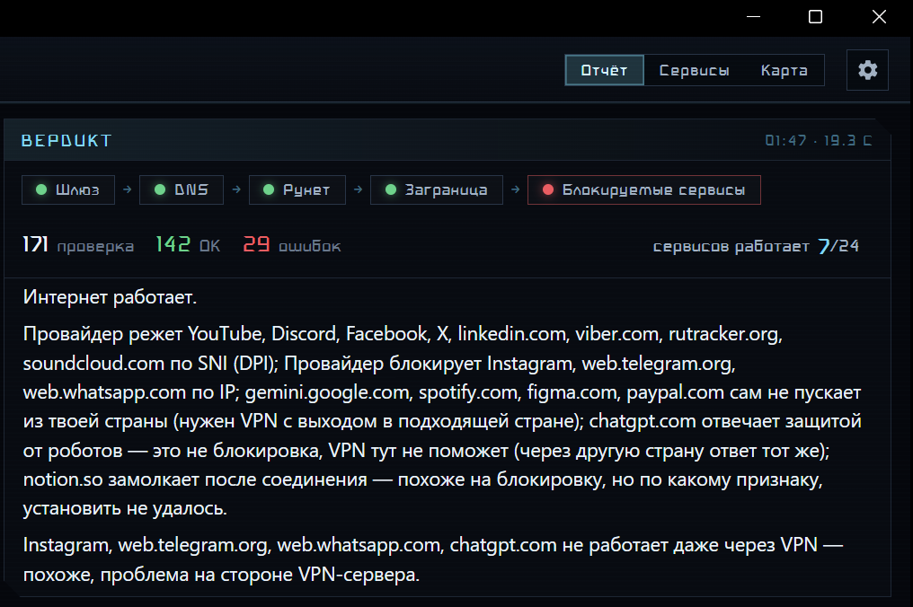
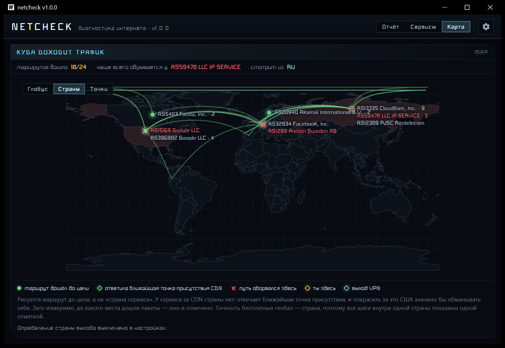
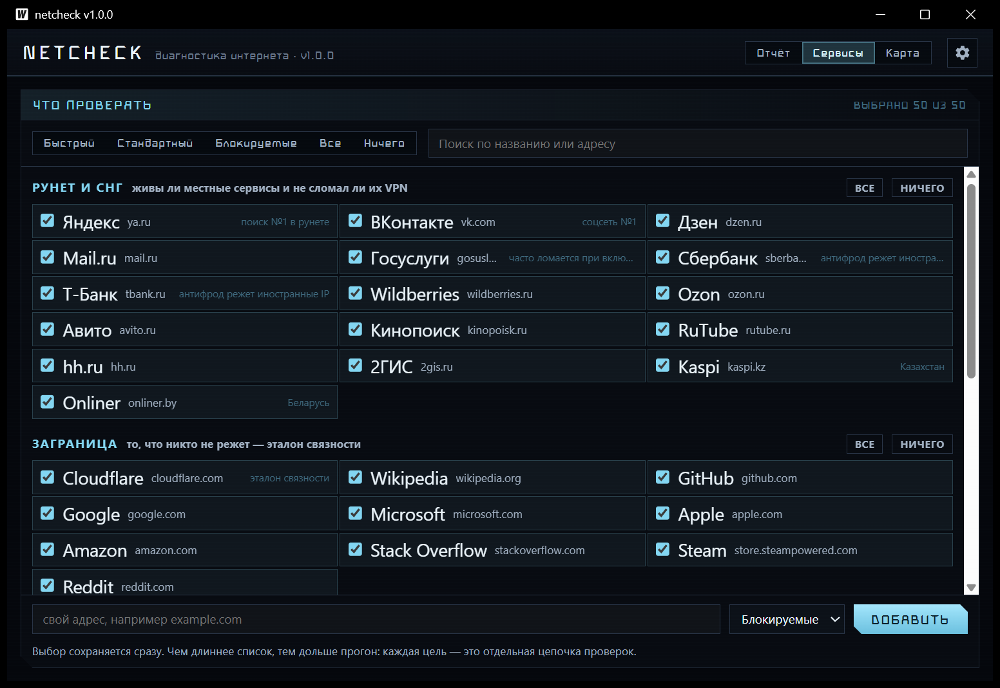

# netcheck

**One button. It tells you why the internet is broken — and whether your VPN is the reason.**

🇷🇺 [Русская версия](README.md)

`ping` tells you a host is unreachable. It doesn't tell you *why*. netcheck runs a
layered battery of checks and answers in plain words: is it your Wi-Fi, your ISP's
DNS, deep packet inspection, or the VPN you just turned on?



## What it actually checks

Layer by layer, bottom-up — the verdict points at the first thing that's broken:

1. **Gateway** — ICMP to your router. No answer? It tries TCP to an outside address:
   if that works, only ICMP is filtered and the run continues; if it doesn't, there is
   no network and the run stops, because every later layer would lie the same way.
2. **DNS** — resolves control domains two ways: your system resolver, and
   DNS-over-HTTPS that deliberately bypasses the system proxy.
3. **RuNet** — local (Russian) sites, so you can tell "everything is down"
   from "the VPN broke local traffic".
4. **Global** — ordinary foreign hosts that nobody blocks.
5. **Blocked services** — YouTube, Discord, Instagram, X and fifty more to choose from.
   Each one is tested **twice**: directly and through whatever local proxy your VPN client
   is running. That's how you see "the ISP blocks it, the VPN fixes it" versus "it's
   broken even through the VPN".

For every target that fails, netcheck diagnoses the *mechanism* — and it does so from the
**class of failure**, not from the mere fact that something didn't work. Silence until the
timeout means interference on the path; a fast RST, TLS alert or EOF means the server itself
answered. Without that distinction, DPI is indistinguishable from an honest refusal:

| Verdict | How it's detected |
|---|---|
| DNS spoofing | the resolver returned a private-range address — no such thing exists on the internet |
| IP block | TCP:443 fails to every address the name resolves to |
| DPI by SNI | TCP connects, TLS with the real name goes silent, TLS with a neutral name gets an answer in milliseconds |
| Forged certificate | the chain doesn't verify against the system roots — something is in the middle |
| ISP stub page | a redirect to a foreign domain that the control path doesn't produce |
| Service geo-block | the server answered 451, or answers differently from another country |
| Anti-bot challenge | 403/429 with challenge markers — and it's identical from any country |
| Service is down | 5xx from the service itself |

A disagreement between your resolver and DoH is **not** counted as spoofing: for any CDN
that's ordinary GeoDNS, and it used to be exactly what filed YouTube under "DNS spoofing"
instead of DPI.

Splitting the last two rows is what makes the answer useful. ChatGPT and Cloudflare-fronted
sites return 403 from Moscow and from Stockholm alike: that's an anti-bot check, cured by a
browser rather than by another country. Netflix and Spotify, on the other hand, refuse you
**themselves** — no VPN fixes that, only an exit node in a country they accept.

## Map: how far the traffic gets

A separate tab draws the route to every target — a ray from you to the place where the
path ended. Reached the target → a solid green line. Didn't → the line stops where the
last router answered, and that spot gets a cross labelled with who owns it:
"AS12389 Rostelecom, hop 2". The country where the path broke is highlighted.

It draws the route, not the "country of the service" — and that distinction is the whole
point. A service behind a CDN has no country: `104.18.32.47` is registered to the US but
answers in 32 ms, which from Moscow is physically impossible — a Moscow edge node is
answering. Those get a diamond and a label of their own instead of painting the US green.
What *is* measurable is how far the packets got, and that is what gets marked.

There is a third case that's easy to mistake for a block: the service answers, but the
traceroute doesn't get through. That's not a block, it's ICMP filtering along the path —
half the backbone routers don't answer on principle. Such a route is drawn dimmed and
labelled honestly, rather than with a cross that would contradict the report tab.

Free geo databases resolve to country at best, so every hop inside one country is shown
as a single mark: drawing ten dots across Russia just because ten routers live there would
be pretending to know something we don't. The database is embedded in the binary (DB-IP
Lite, CC BY 4.0) — the map works when the network is already broken, and no address ever
leaves your machine.



Optionally (`map.geo_lookup`, off by default) the map also pins where the internet sees you
from — directly and through your VPN. That is the only feature that tells anything about you
to a third party, which is why it ships disabled.

It also reads your environment: which adapter and gateway are active, whether a local
proxy is listening (SOCKS5 or HTTP), whether the Windows system proxy is on, whether a
tunnel adapter holds the default route, and whether Tailscale is using an exit node.
That's how it can tell you the single most common trap: *the VPN is running, but the
system proxy is off, so your browser is going around it.*

## Install

Download `netcheck.exe` from [Releases](../../-/releases) and run it. That's it —
no installer, no dependencies, no admin rights. It's a single ~11 MB binary using the
WebView2 runtime that ships with Windows 10/11.

netcheck does not install a service, does not start with Windows, and does not run in
the background. You open it, press the button, read the verdict, close it.

## Configuration

On first run it creates `%APPDATA%\netcheck\config.yaml`:

```yaml
lang: auto            # auto|ru|en
ui:
  scale: m            # interface size: s|m|l|xl
  font_hud: ""        # HUD font family; empty = Bahnschrift
  font_mono: ""       # data font family; empty = Cascadia Mono
  font_file: ""       # optional path to a .ttf/.otf to use without installing it
  tab: report         # tab to open on: report|services|map
services:
  enabled: [ya, vk, gosuslugi, cloudflare, wikipedia, github,
            youtube, discord, instagram, x, chatgpt, netflix, spotify]
  custom:             # your own targets, absent from the catalog
    - host: example.internal
      group: runet    # runet|global|blocked|geo
ping:
  gateway: true
  global_ip: 1.1.1.1
proxy_ports: [10808, 10809, 2080, 2081, 7890, 7897, 1080]
map:
  enabled: true
  style: globe        # globe|countries|dots
  spin: true
  geo_lookup: false
timeouts:
  probe_ms: 3000
  run_ms: 20000
history_keep: 100
```



You don't have to edit this by hand: the **Services** tab shows the whole catalog — fifty
services grouped by kind — lets you tick the ones you care about, add your own address, and
apply a ready-made set: `quick`, `standard`, `blocked` or `full`. The selection is stored as
identifiers rather than hostnames, because a service's hostname changes between releases and
its identifier doesn't. An older config that listed hosts is migrated automatically; nothing
you had selected is lost.

Add the port your VPN client listens on to `proxy_ports` if it isn't in the list. Run
history lives next to the config in `runs.jsonl`.

Fonts are also settable from the gear icon in the app: pick any family installed on
your system, or point `font_file` at a `.ttf`/`.otf` anywhere on disk — it's inlined
into the page at runtime, so a font you own never has to be installed system-wide or
shipped with the app.

## Privacy

netcheck talks only to the hosts in your config — the ones you can see and edit. It
sends no telemetry, opens no listening port, and stores nothing outside
`%APPDATA%\netcheck\`.

## Build from source

Requires [Go](https://go.dev/dl/) 1.25+ and the [Wails](https://wails.io) CLI:

```bash
go install github.com/wailsapp/wails/v2/cmd/wails@v2.13.0
wails build
```

Run the tests with `go test ./...`. The diagnosis and verdict engines are pure
functions with table-driven tests — that's where the actual product logic lives.
There's also a live test that talks to the real network, off by default:

```bash
go test -tags live -run TestLive -v .
```

The probing methodology — what was measured, against which targets, and why the
conclusions look the way they do — is written up in
[docs/superpowers/specs/2026-08-02-probe-v2.md](docs/superpowers/specs/2026-08-02-probe-v2.md).

## License

GNU AGPL-3.0 — see [LICENSE](LICENSE). If you run a modified version and let other
people use it over a network, you have to offer them its source too.

Third-party data and libraries bundled in the binary, with the attribution their
licences require, are listed in [NOTICE](NOTICE) — notably the offline IP-to-country
and IP-to-ASN database, which is [DB-IP](https://db-ip.com) Lite under CC BY 4.0.
